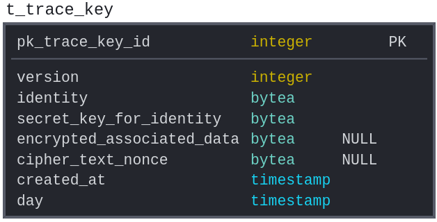

# NotifyMe SDK Backend

[](https://github.com/notifyme-app/notifyme-sdk-backend/blob/master/LICENSE)

[](https://sonarcloud.io/dashboard?id=notifyme-app_notifyme-sdk-backend)

## Introduction
NotifyMe is a decentralised check-in system for meetings and events. Users can check in to a venue by scanning a QR Code. The check in is stored locally and encrypted. In case one of the visitors tests positive subsequent to a gathering, all other participants can be easily informed via the app. The implementation is based on the [CrowdNotifier White Paper](https://github.com/CrowdNotifier/documents) by Wouter Lueks (EPFL) et al. The app design, UX and implementation was done by [Ubique](https://ubique.ch/). More information can be found [here](https://notify-me.ch).

## Repositories
* Android SDK: [crowdnotifier-sdk-android](https://github.com/CrowdNotifier/crowdnotifier-sdk-android)
* iOS SDK: [crowdnotifier-sdk-ios](https://github.com/CrowdNotifier/crowdnotifier-sdk-ios)
* Android Demo App: [notifyme-app-android](https://github.com/notifyme-app/notifyme-app-android)
* iOS Demo App: [notifyme-app-ios](https://github.com/notifyme-app/notifyme-app-ios)
* Backend SDK: [notifyme-sdk-backend](https://github.com/notifyme-app/notifyme-sdk-backend)
* Web Apps: [notifyme-webpages](https://github.com/notifyme-app/notifyme-webpages)

## Work in Progress
The NotifyMe SDK Backend contains alpha-quality code only and is not yet complete. It has not yet been reviewed or audited for security and compatibility. We are both continuing the development and have started a security review. This project is truly open-source and we welcome any feedback on the code regarding both the implementation and security aspects.

## Further Documentation
The full set of documents for CrowdNotifier is at https://github.com/CrowdNotifier/documents. Please refer to the technical documents and whitepapers for a description of the implementation.

## Dependencies
* Spring Boot 2.4.0
* Java 11 (or higher)
* Logback
* [Springboot-Swagger-3](https://bintray.com/ubique-oss/springboot-swagger3)

### Database
For development purposes a hsqldb can be used to run the webservice locally. For production systems, it is recommended to connect to a PostgreSQL dabatase (cluster if possible). There is a table for storing submitted trace keys. The schema is the following:



## Environments
To control different behaviors, SpringBoot profiles are used. The idea is to provide an abstract base class, which defines everything needed. Such properties can be defined as abstract, and their implementation can be provided in an extended class.

#### WSCloud*Config/WSProdConfig/WSDevConfig
Currently four non-abstract configs (`dev`, `test`, `abn` and `prod`) are provided. Those are the CloudConfigs and they are optimized to work with an environment using KeyCloak and CloudFoundry.

Furthermore, two non-abstract configs (`dev`, `prod`) are provided, which implement a basic configuration, and which should work out-of-the-box.

> Note that the `dev` config uses a HSQLDB, which is non-persistent, whereas `prod` needs a running instance of PostgreSQL, either in a docker (a [docker-compose file](docker-compose/stack.yml) is provided) or native.

If you plan to provide new extensions or make adjustments and want to provide those to the general public, it is recommended to add a new configuration for your specific case. This can be e.g. an abstract class (e.g. WSCloudBaseConfig), which extends the base class providing certain needed keys or functions. If you provide an abstract class, please make sure to add at least one non-abstract class showing the implementation needed.

## Trace Keys
There are two endpoints, one for uploading and one for downloading trace keys. How long trace keys are stored in the database can be configured via the `db.removeAfterDays` property in the properties file.

- /v1/traceKeys?lastBundleTagId=\<lastSync\>: `GET` Returns a list of trace keys. The optional `lastBundleTagId` is returned in each response from the backend and should be used by clients for the follwoing request. If set, only keys are retrived since the last download.

- /v1/debug/traceKeys?startTime=\<startTime\>&endTime=\<endTime\>&ctx=\<ctx\>&msg=\<msg\>: `POST` This request is used by the web app [notifyme-webpages](https://github.com/notifyme-app/notifyme-webpages) to upload an encoded trace key (`ctx`) together with start and end time of the problematic event in epoch milliseconds. Optionally, a message (`msg`) can be provided which is then shown to the clients.

## Swagger
We use [Springboot-Swagger-3](https://github.com/Ubique-OSS/springboot-swagger3) to generate a `YAML` based on settings and controllers found in the project. We include a up-to-date version in each release. Currently they are lacking the documentation, but should provide enough information to use them in [Swagger Editor](https://editor.swagger.io).

## Build
To build you need to install Maven.

```bash
cd notifyme-sdk-backend
mvn install
```

## Run
```bash
java -jar notifyme-sdk-backend-ws/target/notifyme-sdk-backend-ws-*.jar
```

## Dockerfiles
The dockerfile includes a base jdk image to run the jar. To actually build the docker container, you need to place the generated jar in the bin folder.

```bash
cp notifyme-sdk-backend/notifyme-sdk-backend-ws/target/notifyme-sdk-backend-ws*.jar notifyme-ws/ws/bin/notifyme-sdk-backend-ws-1.0.0.jar
```

```bash
cd notifyme-ws && docker build -t <the-tag-we-use> .
```

```bash
docker run -p 80:8080 -v <path_to_logbackxml>:/home/ws/conf/notifyme-sdk-backend-ws-logback.xml -v <path_to_application_properties>:/home/ws/conf/notifyme-sdk-backend-ws.properties <the-tag-we-use>
```

## Makefile
You can use the provided makefile to build the backend, build a docker image and generate the documentation.

Without a target, the makefile will generate everything except the docker image.

```bash
make
```

To build the docker image run

```bash
make docker-build
```

This will build the jar and copy it into the `notifyme-ws/ws/bin` folder, from where it is then added to the container image.
The image will be tagged as `notifyme-docker`.

An example `logback.xml` is found in the `resources` folder for the `notifyme-sdk-backend-ws` Java module.

An example `application.properties` file is found at the same location.
Just make sure the configuration matches with your deployment (c.f. `WSBaseConfig` for possible properties
and `WSCloudBaseConfig` for some `CloudFoundry` specific properties)


## License
This project is licensed under the terms of the MPL 2 license. See the [LICENSE](LICENSE) file.
